# EYOUTH-30912011609418-ShopSphere - Project Submission

**Student ID:** EYOUTH-30912011609418
**Repository:** <https://github.com/Mo-Ghobashy/EYOUTH-30912011609418-ShopSphere> (public)

This is the submission door for ShopSphere. Anyone with this link can view the project: a deployed application, a deployed review service, a serverless function, a CI/CD pipeline, monitoring, and all supporting documents. Each of the four tasks is described below with its live URLs and the exact screenshots that prove it.

---

## Overview

ShopSphere is a full-stack e-commerce application:

- **Frontend** (React + Vite) hosted on Vercel.
- **Backend** (Express + Node + Prisma) hosted on Vercel, connected to a **Supabase** PostgreSQL database.
- **Review service** (a separate microservice) deployed at its own URL; ShopSphere shows reviews through a REST proxy.
- **Welcome-email function** (a serverless function) deployed separately and called fire-and-forget after registration.
- **CI/CD pipeline** (GitHub Actions) with three environments (development, staging, production), structured logging, a rollback plan, and monitoring (UptimeRobot).

---

## Task 1 - Production Deployment, Database, HTTPS, Security and Monitoring

### Deliverables

The production deployment itself: frontend URL, backend URL, health-check endpoint, and the monitoring service registered on that endpoint.

### URLs

| Component | URL |
|-----------|-----|
| Application (Frontend) | <https://eyouth-shopsphere.vercel.app> |
| Backend API | <https://eyouth-shopsphere-api.vercel.app> |
| Health check (backend) | <https://eyouth-shopsphere-api.vercel.app/api/health> |
| Health check (review service) | <https://review-service-three.vercel.app/api/health> |
| Monitoring (UptimeRobot public status) | <https://stats.uptimerobot.com/VE47gDJ9Jt> |

- **HTTPS:** all Vercel URLs serve HTTPS (TLS) by default.
- **Database:** Supabase (PostgreSQL) via Prisma.
- **Secrets:** stored as GitHub Actions secrets and in `.env` (gitignored); no `.env` is committed.

### Screenshots

**1.1 - Frontend with HTTPS padlock**

What it proves: the public frontend opens for anyone over HTTPS.

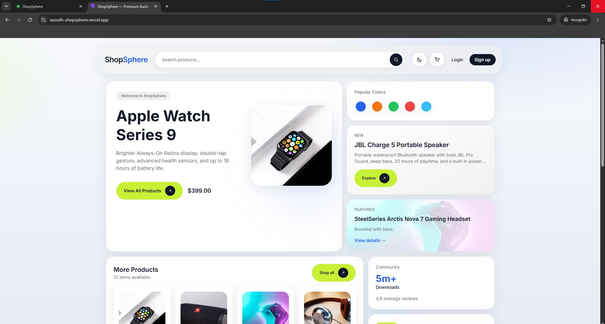

**1.2 - Backend health check 200**

What it proves: the backend is live and healthy (`/api/health` returns `200` / `{"status":"ok",...}`).

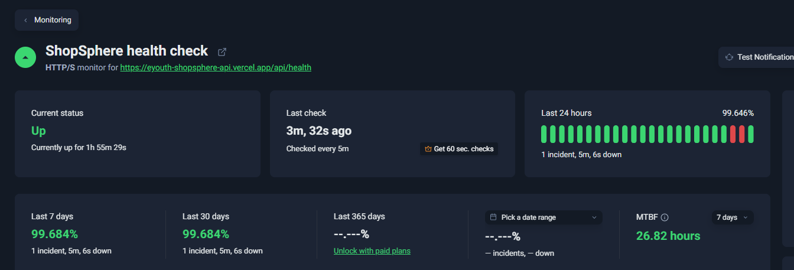

**1.3 - Frontend API calls to production**

What it proves: the frontend talks to the production backend (Network tab shows calls to `https://eyouth-shopsphere-api.vercel.app/api/`, not `localhost`).

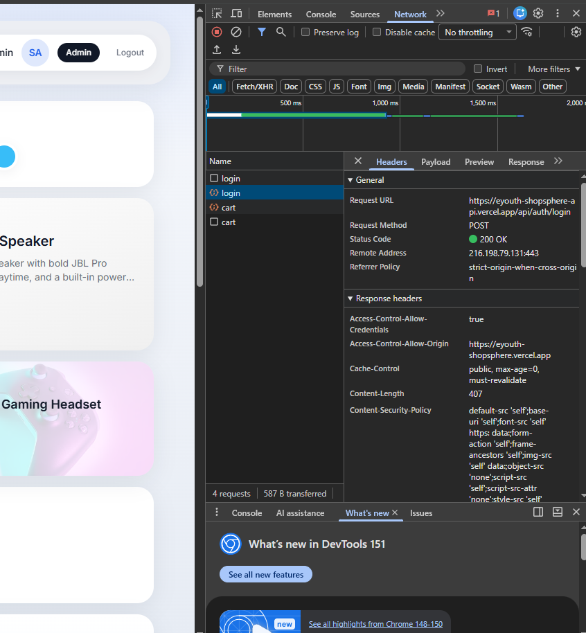

**1.4 - Rate limiting returns 429**

What it proves: rate limiting is active (11 rapid login attempts return `429 Too Many Requests`).

*(screenshot to be added)*

**1.5 - UptimeRobot public status UP**

What it proves: monitoring is live and public (both monitors show `UP` in an incognito window).

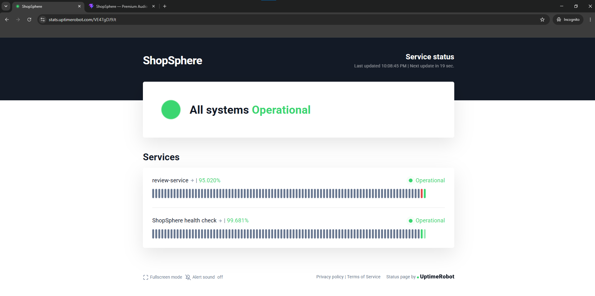

---

## Task 2 - Architecture Diagram, Service Classification and Kubernetes

### Deliverables

The architecture diagram, the document classifying the three services with reasons, and the Kubernetes manifest files.

### Documents

| File | Location |
|------|----------|
| Architecture diagram | `EYOUTH-30912011609418-ShopSphere-Task2/EYOUTH-30912011609418-ShopSphere.drawio` (open with draw.io) |
| Service classification | `EYOUTH-30912011609418-ShopSphere-Task2/EYOUTH-30912011609418-ShopSphere-classification.md` |
| Kubernetes manifests | `k8s-simulation/` (two namespaces: `aws-simulation`, `gcp-simulation`) |
| Kubectl instructions | `k8s-simulation/README.md` |

Classification summary: Vercel (frontend hosting) = PaaS; Vercel (backend hosting) = PaaS; Supabase (PostgreSQL) = SaaS.

### Screenshots

**2.1 - Architecture diagram**

What it proves: the architecture diagram deliverable (export the `.drawio` as a PNG).

**2.2 - `kubectl get ns`**

What it proves: two namespaces exist (`aws-simulation` and `gcp-simulation`).

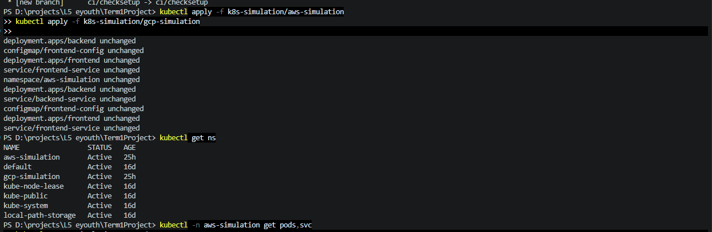

**2.3 - AWS namespace resources**

What it proves: `kubectl -n aws-simulation get all` shows pods and services `Running` in the AWS namespace.

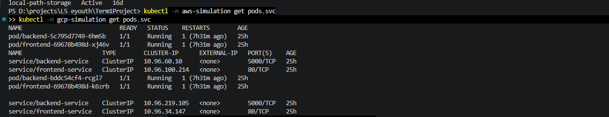

**2.4 - GCP namespace resources**

What it proves: `kubectl -n gcp-simulation get all` shows pods and services `Running` in the GCP namespace.

*(screenshot to be added)*

**2.5 - Namespace isolation**

What it proves: each `get all` lists only its own pods (the `aws-simulation` and `gcp-simulation` listings are shown side by side, with no cross-listing), so resources are isolated.

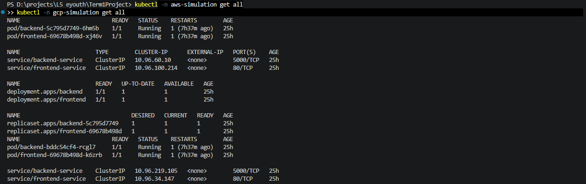

**2.6 - AWS frontend port-forward**

What it proves: the AWS frontend Service responds via port-forward (`http://localhost:8080` shows "Simulated on AWS (EKS) / Namespace: aws-simulation").

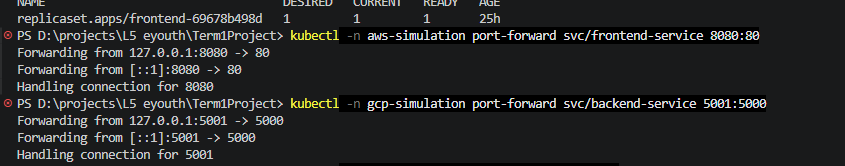

**2.7 - GCP backend port-forward**

What it proves: the GCP backend Service responds via port-forward (`http://localhost:5001` returns the gcp JSON).

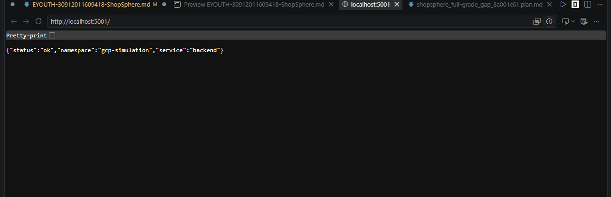

---

## Task 3 - Review Service, Serverless Function and Architecture Decision Record

### Deliverables

The URL of the deployed review service, the serverless function in working order, and the architecture decision record.

### URLs and Documents

| Component | URL / File |
|-----------|-----------|
| Review Service | <https://review-service-three.vercel.app> |
| Welcome-email serverless function | <https://eyouth-emailservice.vercel.app> |
| Architecture Decision Record | `EYOUTH-30912011609418-ShopSphere-Task3/EYOUTH-30912011609418-ShopSphere-ADR.md` |

- **Review extraction:** reviews now live only in the review service; they are removed from the main backend schema. ShopSphere shows reviews through the REST proxy.
- **Serverless welcome email:** the backend POSTs `{ email, name }` fire-and-forget to `EMAIL_SERVICE_URL` after registration.

### Screenshots

**3.1 - Reviews shown in ShopSphere**

What it proves: a product page in ShopSphere displays reviews retrieved from the review service; reviews are shown via the microservice REST interface.

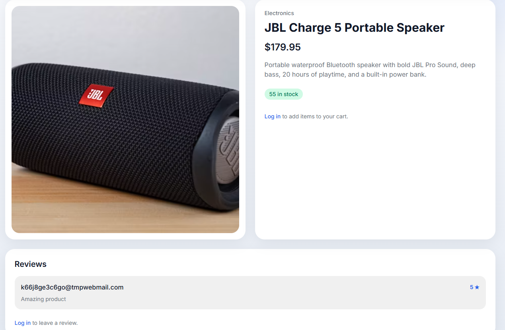

**3.2 - Welcome email received**

What it proves: the serverless function sends emails end-to-end (a freshly received "Welcome" email after registering a new account).

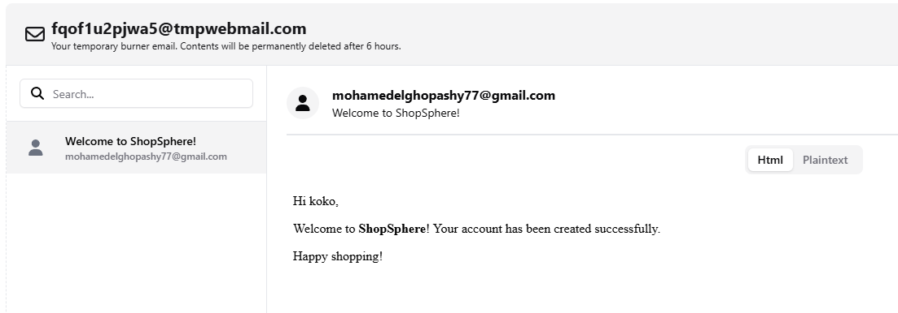

**3.3 - Review service working** *(optional)*

What it proves: the review service is deployed and responds at its URL.

*(screenshot to be added)*

Note - the ADR: the Architecture Decision Record is a repository file, no screenshot required.

---

## Task 4 - CI/CD Pipeline, Logging, Rollback Plan and Project Sharing

### Deliverables

The pipeline on the repository, the rollback plan document, and the project links document.

### Documents

| Component | URL / File |
|-----------|-----------|
| CI/CD pipeline | `.github/workflows/ci.yml` (this repository) |
| Rollback plan | `EYOUTH-30912011609418-ShopSphere-Task4/EYOUTH-30912011609418-ShopSphere-rollback.md` |
| This links / sharing document | this file (`EYOUTH-30912011609418-ShopSphere.md`) |

- **Pipeline:** GitHub Actions installs, builds, and tests, then deploys to production on a merge into `main`. Three environments exist: development, staging, production, each with its own variables.
- **Secrets:** stored as GitHub Actions secrets; no credential appears in the workflow file or run logs (values are masked or absent).
- **Branch protection:** `main` requires the `Install, Build & Test` status check to pass before a merge.
- **Structured logging:** request and error logs carry an ISO timestamp and a severity level (`INFO`, `WARN`, `ERROR`); read in production at Vercel Dashboard, project `eyouth-shopsphere-api`, Logs (Runtime Logs).

### Screenshots

**4.1 - Complete green pipeline run**

What it proves: a complete pipeline run reached production (`Install, Build & Test` and `Deploy to Production` both pass on `main`).

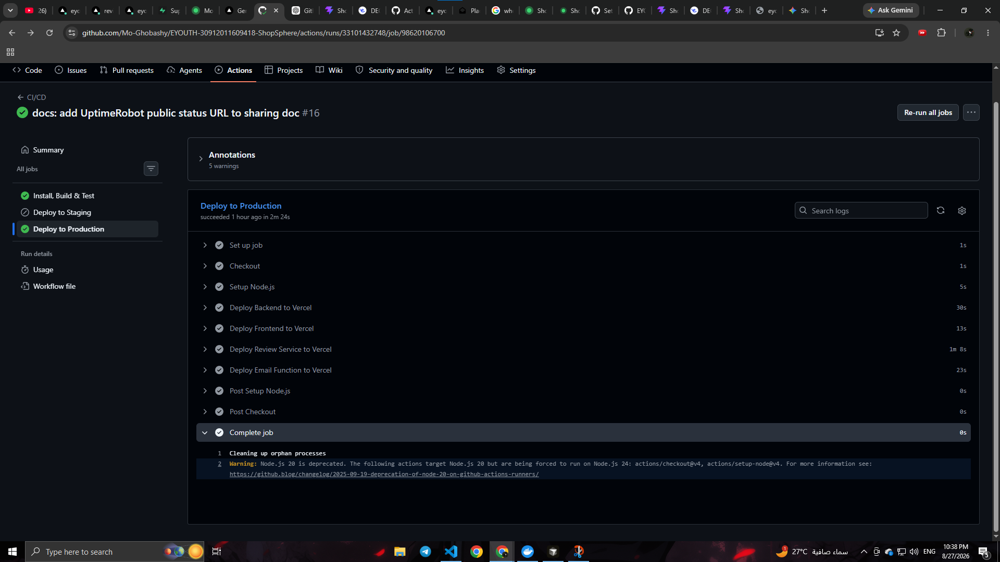

**4.2 - No secrets in run logs**

What it proves: no credential appears in the run logs (the deploy job logs show secret references as masked or absent; a search for the real token finds nothing).

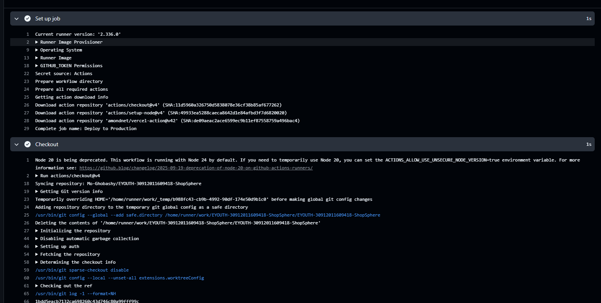

**4.3 - Three environments**

What it proves: the three environments exist.

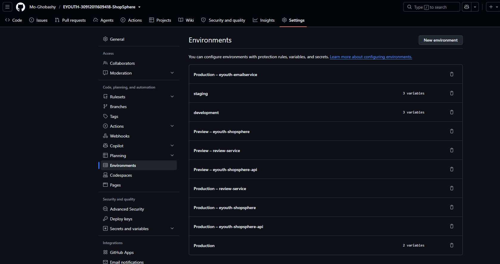

**4.4 - Branch protection ruleset**

What it proves: main is branch-protected (a ruleset on `main` requires the `Install, Build & Test` check).

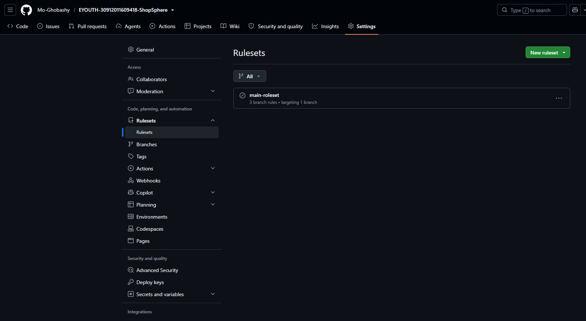

Note - the rollback plan: the rollback plan is a repository file (`EYOUTH-30912011609418-ShopSphere-Task4/EYOUTH-30912011609418-ShopSphere-rollback.md`), no screenshot required.

---

## All Project URLs in One Table

| Component | URL |
|-----------|-----|
| Application (Frontend) | <https://eyouth-shopsphere.vercel.app> |
| Backend API | <https://eyouth-shopsphere-api.vercel.app> |
| Health check (backend) | <https://eyouth-shopsphere-api.vercel.app/api/health> |
| Review Service | <https://review-service-three.vercel.app> |
| Health check (review service) | <https://review-service-three.vercel.app/api/health> |
| Welcome-email serverless function | <https://eyouth-emailservice.vercel.app> |
| Monitoring (UptimeRobot public status) | <https://stats.uptimerobot.com/VE47gDJ9Jt> |
| Repository | <https://github.com/Mo-Ghobashy/EYOUTH-30912011609418-ShopSphere> |

---

